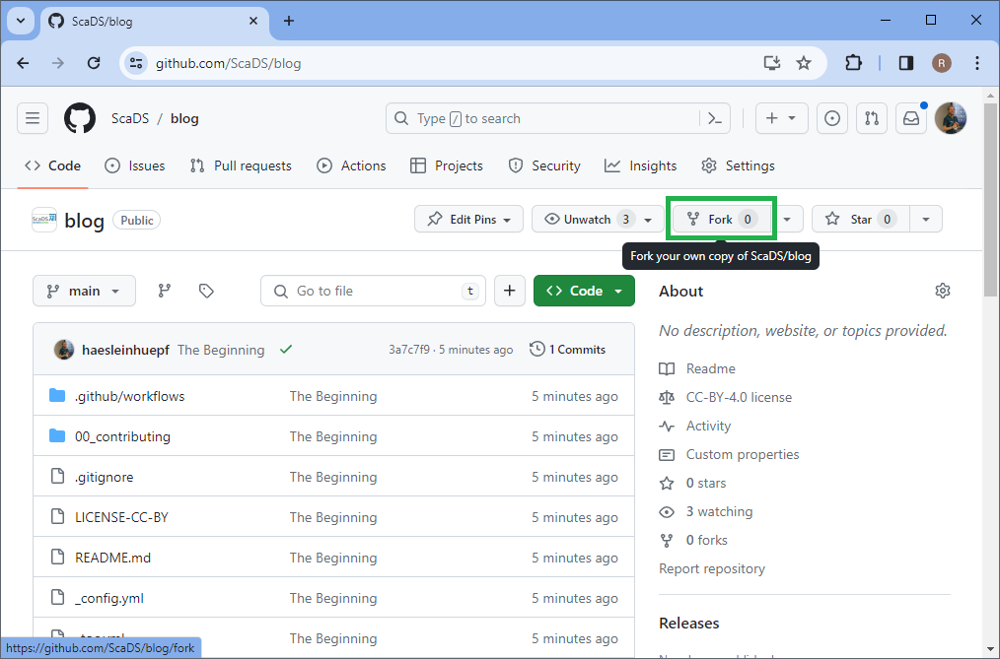
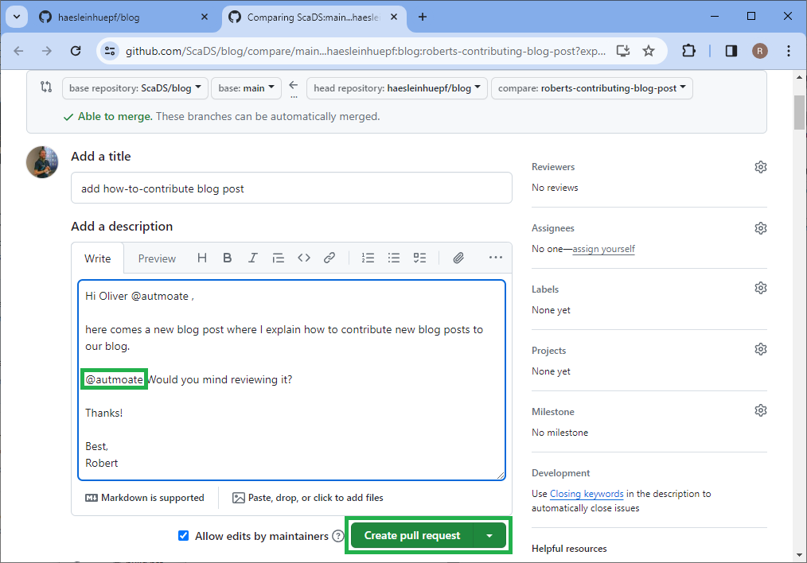

# How to contribute

On this page we will explain how you can contribute a blog post to this resource. 
Before we get started, make soure you you have a [github.com](https://github.com) account. 
We also recommend to install [Github desktop](https://desktop.github.com/) in particular if you are new to version control with git.

## Before creating a new blog post

Before you start writing a blog post, we recommend creating a [github issue](https://github.com/ScaDS/blog/issues/new) to let us know about your idea for a post. 
In general, we welcome all kinds of topics related to data science and artificial intelligence, especially about projects happening ad ScaDS.AI. 
We just would like to guide you through the process and thus, communicating in a github issue might make a lot of sense.

## Creating a new blog post

To create a new post, we recommend forking the project, by navigating to the github repository:

[https://github.com/ScaDS/blog](https://github.com/ScaDS/blog)

and clicking here:

This will create a copy of the repository in your own github account, where you can make any kinds of changes without affecting the original repository.

Next, you can clone the repository to your local computer using Github desktop, just click on the green `Code` button and the menu `Open with Github Desktop`:

This will open Github desktop and you can clone the repository to your local computer:

The program will ask you this question and you should choose to contribute to the parent project:

You now have a local copy of the repository on your computer and you can start editing the files.
We will here use [Pycharm](https://www.jetbrains.com/pycharm/) for this. If your blog post contains Python code, ideally in the form of Jupyter Notebooks, we recommend [Jupyter lab](https://jupyter.org/) or [Visual Studio Code](https://code.visualstudio.com/) as editor.

Open the project in Pycharm and add a new folder, such as `00_contributing`. The initial two numbers just ensure that the blog posts are ordered chronologically. Thus, if folder `14_abc` exists, just add a new folder `15_your_topic`. 
Within your new folder create a `readme.md` Markdown file:

You can also add screenshots by simply copy pasting them into the markdown file. 
Pycharm will make sure the image file is saved in the same folder.

After you are done with editing, return to github desktop and create a new branch. 
This is important, do not commit directly to the `main` branch.

Enter a meaningful name for the branch, e.g. related to the name of your blog post:

Also make your you take your changes with you to the new branch:

Now go carefully through the changes you did by clicking on the added and edited files.
Just check if all the changes displayed there make sense before committing them.
Remove files that were created unintentionally.
Once you are sure everything is fine, enter a meaningful (!) commit message and click `Commit to ...`:

Upload your changes to github by clicking `Publish branch`:

And create a pull-request to let us know about your changes:

Describe your new contribution shortly and feel free to tag a collague to review your changes:

We will then review your changes and potentially ask for changes, e.g. like this:

Which you can then confirm by committing directly from the browser:

You can also add more text and images and submit them using github desktop:

After committing just make sure to upload your changes:

They will then show up in the browser:

